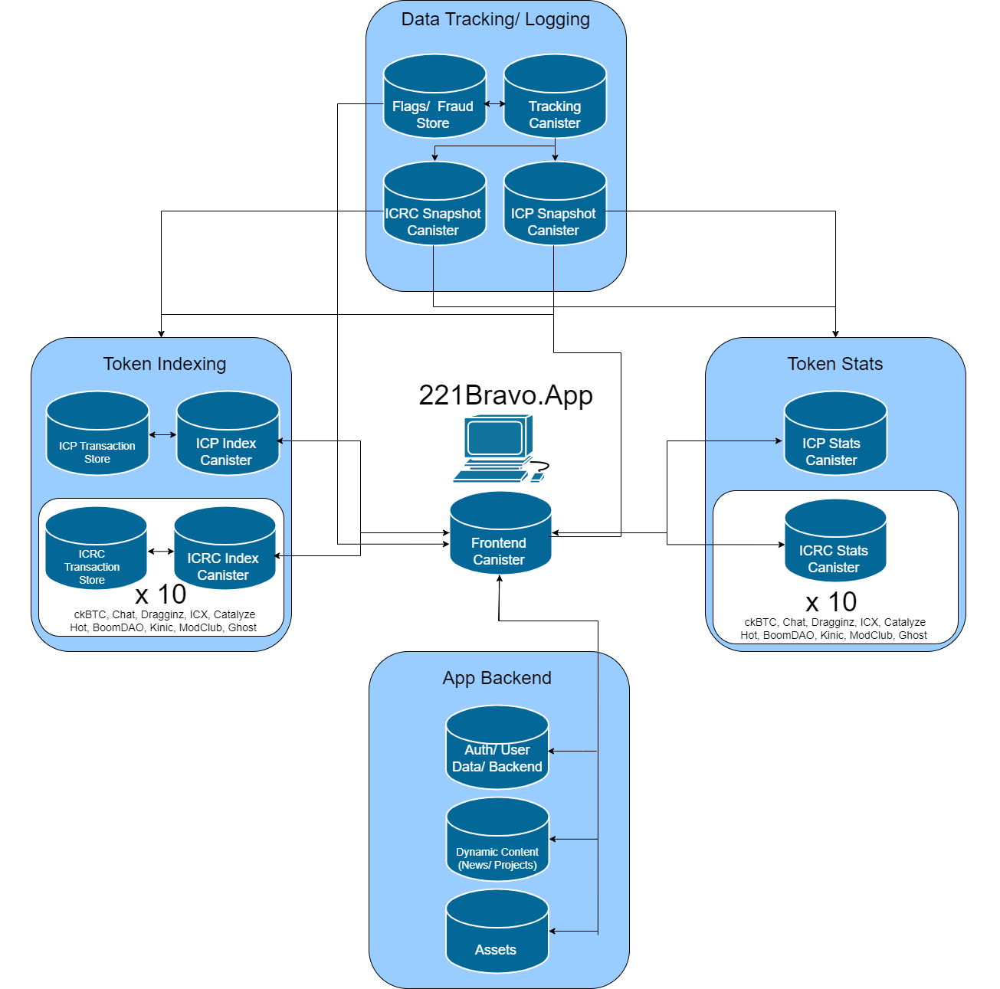

# 221BravoApp
Home for Data-Detectives in the Internet Computer Ecosystem.

221Bravo is a blockchain explorer primarily focused on the Internet Computer Ecosystem giving users the ability to navigate complex data in a simple and understandable way. 
The app is broken down into several sections:

-	Account and block explorer. Covering ICP and SNS (ICRC) tokens. Members get additional information on each account including linked accounts, user saved names and public known names. 
-	Token Stats covering ICP and SNS (ICRC) tokens. Top holders, daily transaction volumes, mint/ burn, whale moves and other great metrics. 
-	Visual Block Explorer allowing the user to explore the latest ICP/ ICRC transactions – quickly identifying links and relationships between accounts. 
-	Members page featuring exclusive tools and members only chat (using Open Chat)

## Overview of Frontend/ Backend canisters 

### Main App and Backend
The application frontend is built using SvelteKit, Vite, HTML/ CSS with Javascript fetching  data from the various other project canisters. The frontend is hosted in single asset canister (src/frontend)
There are 3 main canisters which provide backend support for the frontend canister. 

The main backend canister (src/backend) retains details of users’ (by NFT address). Users’ address book, public named accounts, and methods for converting Principals into ICP sub-accounts. 

The dynamic content canister (src/dynamic_content) stores details of news items and ecosystem projects displayed on index page and ecosystem page. 

The assets canister (src/assets_canister) acts as a dynamic store for news items and ecosystem project logos. 

### Token Stats Canisters
There are two types of Token Stats Canisters – the ICP version (src/icp_data_processer) and ICRC version (src/icrc_data_processer). Both canisters undertake the same function however due to the differences between ICP accounts and ICRC accounts two variants were created. 

In brief, these canisters fetch transactions from a designated ledger canister and calculate a number of stats from these transactions – for example the largest transactions over the last 24 hours or 30 days. The token stats canister runs a timer which schedules when the canister pulls the latest data and updates the stats. The stats are ‘live’ and no history is retained (see Snapshot canister).  

The frontend canister pulls stats directly from the ICP/ ICRC stats canisters. 

### Token Indexing Canisters
The token indexing canister are again spit into two versions – one for ICP transactions and one for ICRC transactions. Each version requires a pair of canisters. The main canister (super index) performs the calculations and the transaction store acts as a storage canister for the transactions processed by the name canister. 

This canister forms the main backbone of the account searching tool on 221Bravo App. This canister also provides methods to get specific blocks or the latest blocks. 

## Using App canisters 
Each of the Stats/ Indexers are designed to (independent) WIP

## License
This project is licensed under the MIT license, see LICENSE.md for details. See CONTRIBUTE.md for details about how to contribute to this project. 

## Acknowledgements
- Hat tip to anyone who's code was used
- External contributors
- Etc.

## References
- [Internet Computer](https://internetcomputer.org)

